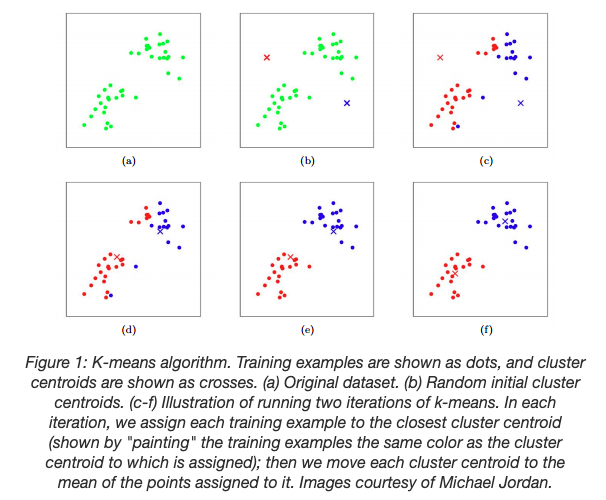

# Unsupervised Learning

Unsupervised learning algorithms discover hidden patterns or data groupings without human intervention. Its ability to discover similarities and differences in information make it he ideal solution for `exploratory data analysis`, `cross-selling strategies`, `customer segmentation`, and `image recognition`.

## Common Unsupervised Learning Algorithms

### Clustering

Clustering is a data mining technique which groups unlabeled data based on their similarities or differences. Clustering algorithms are used to process raw, unclassified data objects into groups represented by structures or patterns in the information. Clustering algorithms can be categorized into a few types, specifically exclusive, overlapping, hierarchical, and probabilistic. 

#### Exclusive & Overlapping Clustering

Exclusive clustering is a form of grouping that stipulates a data point can exist only in one cluster. This can also be referred to as "hard" clustering. The K-means clustering algorithm is an example of exclusive clustering.

Example: K-means Clustering

K-means is one of the most popular clustering algoriths. K-means stores k centroids that it uses to define clusters. A point is considered to be in a particular cluster if it is closer to that cluster's centroid that any other centroids.

K-means finds the best centroids by alternating between 1) assigning data points to clusters based on the current centroids and 2)chosing new centroids based on the current assignment of data points to clusters.

Assume we are given a dataset $D$ and we want to group the data into a few cohensive clusters. Our goal is to predict k centroids and a label for each data point. The algorithm is as follows:

* Initialize cluster centroids $\mu_1, \mu_2, ..., \mu_k \in R^n$ randomly.
* Repeat until convergence:
  * For every $i$, set $c^{(i)}:=\arg \min _j\left\|x^{(i)}-\mu_j\right\|^2$
  * For every j, set 
  
$$
\begin{aligned}
\mu_j:=\frac{\sum_{i=1}^m 1\{c^{(i)}=j\} x^{(i)}}{\sum_{i=1}^m 1\{c^{(i)}=j\}}
\end{aligned}
$$
  

[Image source](https://stanford.edu/~cpiech/cs221/handouts/kmeans.html)

Overlapping clustering differs from exclusive clustering in that it allows data points to belong to multiple clusters with separate degress of membership. "Soft"/"Fuzzy" K-means Clustering is an example of overlapping clustering.

#### Probabilistic Clustering

A probabilistic model is an unsupervised technique that helps us solve density estimation of "soft" clustering problems. In probabilistic clustering, data points are clustered based on the likelihood that they belong to a particular distribution. The Gaussian Mixture Model (GMM) is the one of the most commonly used probabilistic clustering methods.

Example: Gaussian Mixture Model

A Gaussian Mixture Model is parameterized by two types of values, the mixture component weights and the component means and variance/covariances. For a Gaussin Mixture Model with K components, the $k^{th}$ component has a mean of $\mu_k$ and variance of $\sigma_k$ for the univariate case and a mean of $\overrightarrow{\mu_k}$ and covariance $\Sigma_k$ for the multivariate case. The mixture component weights are defined as $\phi_k$ for component $C_k$, with the constraint that $\sum_{i=1}^{K}\phi_i=1$ so that the total probability distribution normalizes to 1. If the component weights aren't learned, they can be viewed as an a-priori distribution over components such that $p(x\ generated\ by\ component\ C_k) = \phi_k$. If they are instead learned, they are the a-posterior estimates of the component probabilities given the data.

One-dimensional model:

$$
\begin{aligned}
p(x)=\sum_{i=1}^K \phi_i \mathcal{N}\left(x \mid \mu_i, \sigma_i\right) \\
\mathcal{N}\left(x \mid \mu_i, \sigma_i\right)=\frac{1}{\sigma_i \sqrt{2 \pi}} \exp \left(-\frac{\left(x-\mu_i\right)^2}{2 \sigma_i^2}\right)\\
\sum_{i=1}^K \phi_i=1
\end{aligned}
$$

Multi-dimensional model:

$$
\begin{aligned}
p(\vec{x})=\sum_{i=1}^K \phi_i \mathcal{N}\left(\vec{x} \mid \vec{\mu}_i, \Sigma_i\right) \\
\mathcal{N}\left(\vec{x} \mid \vec{\mu}_i, \Sigma_i\right)=\frac{1}{\sqrt{(2 \pi)^K\left|\Sigma_i\right|}} \exp \left(-\frac{1}{2}\left(\vec{x}-\vec{\mu}_i\right)^{\mathrm{T}} \Sigma_i^{-1}\left(\vec{x}-\vec{\mu}_i\right)\right)\\
\sum_{i=1}^K \phi_i=1
\end{aligned}
$$

Learning the model:

Models are typically learned by Maximum Likelihood Estimation techniques, which seek to maximize the probability, or likelihood, of the observed data given the model parameters. Unfortunately, finding the maximum likelihood solution for mixture models by differentiating the log likelihood and solving for 0 is usually impossible. 

Expectation Maximization (EM) is a numerical technique for maximum likelihood estimation, and is usually used when closed form expressions for updating the model parameters can't be calculated. It's guaranteed to approach a local maximum or saddle point using EM algorithm.

EM for mixture models consists of three steps(including initialization step):

Initialization Step: 
* Randomly assign samples without replacement from the dataset to the component mean estimates $\hat{\mu_1}, \hat{\mu_2}, ..., \hat{\mu_K}$. 
* Set all component variance estimates to the sample variance $\hat{\sigma_1}^2, \hat{\sigma_2}^2, ..., \hat{\sigma_K}^2$.
* Set all component distribution prior estimates to the uniform distribution: $\hat{\phi_1}, \hat{\phi_2}, ..., \hat{\phi_K}=\frac{1}{K}$.

E-step: calculate the expectation of the component assignment $C_k$ for each data point $x_i$ given the model parameters $\hat{\phi_k}$, $\hat{\mu_k}$, and $\hat{\sigma_k}$:

$$
\begin{aligned}
\hat{\gamma}_{i k}=\frac{\hat{\phi}_k \mathcal{N}\left(x_i \mid \hat{\mu}_k, \hat{\sigma}_k\right)}{\sum_{j=1}^K \hat{\phi}_j \mathcal{N}\left(x_i \mid \hat{\mu}_j, \hat{\sigma}_j\right)}
\end{aligned}
$$

where: $\hat{\gamma}_{i k}=p\left(C_k \mid x_i, \hat{\phi}, \hat{\mu}, \hat{\sigma}\right)$.

M-step: maximize the expectations calculated in the E step with respect to the model parameters. This step consists of updating the values $\hat{\phi_k}, \hat{\mu_k}, \hat{\sigma_k}$:

$$
\begin{aligned}
\hat{\phi}_k=\sum_{i=1}^N \frac{\hat{\gamma}_{i k}}{N} \\
\hat{\mu}_k=\frac{\sum_{i=1}^N \hat{\gamma}_{i k} x_i}{\sum_{i=1}^N \hat{\gamma}_{i k}} \\
\hat{\sigma}_k^2=\frac{\sum_{i=1}^N \hat{\gamma}_{i k}\left(x_i-\hat{\mu}_k\right)^2}{\sum_{i=1}^N \hat{\gamma}_{i k}}
\end{aligned}
$$

When the number of components K is not known as a prior, it is typical to guess the number of components and fit that model to the data using the EM algorithm. 

The entire iterative process repeats until the algorithm converges, giving a maximum likelihood estimate, i.e., for all parameters $\theta_t$ at iteration t, $|\theta_t - \theta_{t-1}| \leq \epsilon$ for some user-defined tolerance $\epsilon$.

Once the EM algorithm has run to completion, the fitted model can be used to perform various forms of inference. The two most common forms of inference done on GMMs are `density estimation` and `clustering`.

Density Estimation:

Since the GMM is completely determined by the parameters of its individual components, a fitted GMM can give an estimate of the probabilities of both in-sample and out-of-sample data points, known as density estimation. Furthermore, since numerically sampling from an individual Gaussian distribution is possible, one can easily sample from a GMM to create synthetic datasets.

Clustering:

Using Bayes' theorem and the estimated model parameters, one can also estimate the posterior component assignment probability. For example, given a univariate model's parameters, the probability that a data point x belongs to component $C_i$ is calculated using Bayes theorem:

$$
\begin{aligned}
p\left(C_i \mid x\right)=\frac{p\left(x, C_i\right)}{p(x)}=\frac{p\left(C_i\right) p\left(x \mid C_i\right)}{\sum_{j=1}^K p\left(C_j\right) p\left(x \mid C_j\right)}=\frac{\phi_i \mathcal{N}\left(x \mid \mu_i, \sigma_i\right)}{\sum_{j=1}^K \phi_j \mathcal{N}\left(x \mid \mu_j, \sigma_j\right)}
\end{aligned}
$$

### Dimensionality Reduction

Dimensionality reduction is a technique used when the number of features, or dimensions, in a given dataset is too high. It reduces the number of data inputs to a manageable size while also perseving the integrity of the dataset as much as possible. It's commonly used in the preprocessing data stage, and there are a few different dimensionality reduction methods that can be used, such as:

Principal Component Analysis:

PCA is a type of dimensionality reduction algorithm which is used to reduce redundancies and to compress datasets through feature extraction. This method uses a linear transformation to create a new data representation, yielding a set of "principal components." The first principal component is the direction which maximize the variance of the dataset. While the second principal component also finds the maximum variance in the data, it is completely uncorrelated to the first principal component, yielding a direction that is perpendicular, or orthogonal, to the first principal component. This process repeats based on the number of dimensions, where a next principal component is the direction orthogonal to the prior components with the most variance.

Major Steps involved in PCA:

* Standardize the range of continuous initial variables
* Compute the covariance matrix to identify correlations
* Compute the eigenvectors and eigenvalues of the covariance matrix to identify the principal components
* Create a feature vector to decide which principal components to keep
* Recast the data along the principal component axes

Singular Value Decomposition:

SVD is another dimensionality reduction approach which factorize a matrix, A, into three, low-rank matrices. SVD is denoted by the formula, A = USVT, where U and V are orthogonal matrices. S is a diagonal matrix, and S values are considered singular values of matrix A. Similar to PCA, it is commonly used to reduce noise and compress data, such as image files.

Autoencoders:

Autoencoders leverage neural networks to compress data and then recreate a new representation of the original data's input. 

[Image source](https://lilianweng.github.io/posts/2018-08-12-vae/)

## References

https://brilliant.org/wiki/gaussian-mixture-model/

https://www.ibm.com/topics/unsupervised-learning
